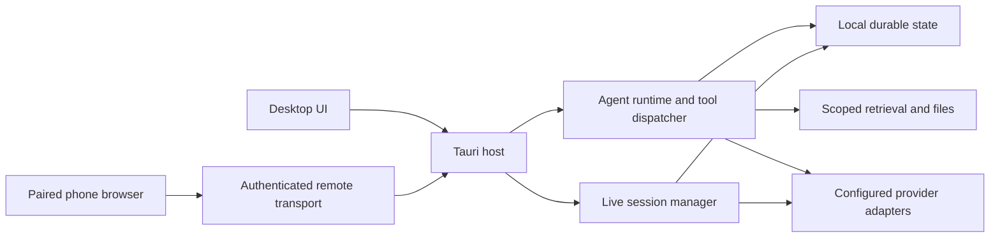

# Nexa Architecture

Status: canonical architecture entry point.

Nexa is a local-first desktop assistant composed of a React user interface in a
Tauri shell, a Rust application and agent runtime, and SQLite-backed durable
state. This document is the single architecture index. Detailed contracts live
in the focused documents linked below; research notes and dated audits do not
become architecture merely by being stored in the repository.

## System boundaries

| Boundary | Responsibility | Primary implementation |
| --- | --- | --- |
| Desktop presentation | Navigation, chat, settings, task state, previews, accessibility, and user-controlled interaction | `apps/desktop/src` |
| Native desktop bridge | Tauri commands, window and tray ownership, operating-system integration, and event projection | `apps/desktop/src-tauri` |
| Core runtime | Agent turns, provider adapters, tools, retrieval, persistence, workflows, and local media/document capabilities | `crates/core/src` |
| Remote transport | Device pairing/revocation, authenticated HTTP and WebSocket requests, encrypted LAN listeners, and managed public routes | `crates/remote/src` |
| Phone presentation | Remote chat, model choices, previews, dictation, and Live using the desktop host | `apps/desktop/src/features/remote` |
| Live observation | Bounded input/session lifecycle, native realtime or incremental observation, text records, and summaries | `crates/core/src/live_analysis` |
| Office live host | Separately paired Word/Excel/PowerPoint operations with declared host capabilities | `integrations/office-addin` and `crates/core/src/office_live_bridge.rs` |
| Shared catalogs | Provider, model, modality, and capability descriptors consumed by both frontend and backend | `shared/` |
| Durable state | Conversations, turns, tool results, checkpoints, settings, sources, and indexes | SQLite migrations and stores under `crates/core/src` |

The UI is a projection of runtime state, not a second source of truth. Provider
payloads and operating-system events enter through explicit adapters. Durable
records authorize replay and recovery; transient UI state must not invent a
successful tool execution or model response.

Remote transport exposes typed host commands rather than arbitrary Tauri IPC.
The desktop still owns execution, credentials, previews, and approval decisions.
Transport liveness is distinct from committed Agent Run progress. Public route
readiness verifies the actual HTTPS, RPC, and WebSocket path before advertising
an endpoint. A browser session or Live observation is also a separate lifecycle
from an Agent Run; it must not manufacture run completion.

## Prompt source and cache layout

The maintained core prompt is `crates/core/prompts/system.md`, compiled into
`agent/mod.rs` with `include_str!`. Edit that file for enduring execution and
trust rules. `agent/route.rs` owns task-specific route guidance; tool schemas
and validators own their arguments and recovery contracts; the desktop
subagent preflight appends worker-specific guidance.

Source-file placement does not determine cache reuse. `agent/prompt_ir.rs` and
`agent/prompt_layout.rs` separate stable policy/tool prefixes from replayable
history and volatile per-step context; provider adapters serialize the final
request. Preserve those boundaries and tool ordering when changing prompt
assembly. Moving unchanged text between a Rust literal and `include_str!`
does not change the effective prompt. Updating its text intentionally changes
the affected prefix.

## Desktop responsiveness and tool ownership

Application IPC enters a bounded blocking dispatcher before calling generated
Tauri handlers. Synchronous database, filesystem and terminal operations must
not run inside the WebView host callback. Calls for the same command and resource
retain arrival order, while different resources proceed independently. Async
commands retain their own transaction and revision fences. Stop/approval/close commands have
reserved admission capacity. Stop lookups and run-ledger commits also have
reserved database lanes, so ordinary database admission cannot reject Stop or
its checkpoint. Both write lanes use the same serialized SQLite connection.
Database-only commands use `DatabaseExecutor`:
independent readers for queries, the writer lane for mutations (including
interaction reads that expire requests). Native window work still crosses
Tauri's UI dispatch boundary. Terminal pipe disposal never holds the global
session registry; frontend terminal input is ordered per session.

Delegated executors share the parent's Activity Runtime and tool ownership
scope while keeping their transcript private. A managed process and its output
remain observable after its launching worker finishes. Provider HTTP pools are
scoped to the executing Tokio runtime, so closing a worker cannot invalidate
the parent's pooled connection dispatch tasks.

Companion projections read bounded run metadata and the latest event header,
without loading tool payload history. UI refreshes coalesce while one request
is pending. Worker capsules merge durable and live identities, keep terminal
states monotonic, and show compact task labels.

The chat Git capsule reads the effective conversation/project source scope;
unscoped chats use registered sources, matching file tools. The current linked
terminal can also contribute its launch directory. It does not infer directories
from assistant prose or a shell's later `cd` commands. Canonical duplicate scopes
are scanned once, up to four at a time. A missing Git executable or inaccessible
source is an explicit diagnostic and cannot hide healthy repositories. The UI
coalesces refresh bursts and preserves unchanged repository objects so a poll
does not restart an open diff request. Manual refresh and completed tools still
invalidate open diffs even when filenames and status letters are unchanged.
Phone history merging indexes message IDs
once and preserves expanded text and older pages.

## Run Event publication boundary

The core runtime owns one Run Event outbox per Agent Run. It is the sole
authority for Run Event sequencing, batching, Run Event-derived task
projection, and terminal acceptance. Producers submit unsequenced events
through a bounded, non-blocking interface; the native desktop bridge supplies
only the post-commit delivery adapter. Consequently, a missing main window
cannot block durable run completion, and presentation code cannot race the core
ledger with a second sequence or terminal decision.

Replaceable tool-input previews use a separate ephemeral publication method on
that same outbox. They retain live sequence order but never enter SQLite, and
queue pressure may drop them without failing the authoritative run. Durable
lifecycle boundaries still flush and commit before delivery.

The outbox tracks live and durable sequence heads separately. A pause fences
against the durable head but can commit after ephemeral sequence gaps. Frontend
reconciliation accepts an authoritative terminal snapshot even when terminal
event delivery was lost, and cannot resurrect that run from a stale active
snapshot. Already-consumed interaction answers never become retryable simply
because a later tool failed.

Resumable phases such as paused and awaiting user input keep the same outbox
open. True terminal outcomes close it permanently, and finalization crosses the
completion barrier only after both the terminal event and task projection are
durable. Per-run lifecycle serialization also covers durable continuation
claims, executor spawn, session registration, pause, and stop. Startup recovery
uses the Run Event ledger to restore suspensions or terminalize interrupted
work instead of letting task rows invent a second outcome. The detailed
batching, failure, recovery, and wire rules are normative in the
[Agent Streaming Protocol](./AGENT_STREAMING_PROTOCOL.md).

## Delegation ownership

The parent registry is filtered for execution mode, workflow scope and workspace
isolation before delegation. An absent saved subagent tool list inherits that
registry; an explicit list narrows it. Role recommendations choose defaults and
do not replace permissions. Spawn schemas and preflight checks use the same
effective scope. Interactive surfaces and recursive delegation remain excluded.

The delegation runtime stores worker tools without retaining the delegation
wrappers that own it. This prevents a registry/runtime reference cycle from
retaining provider state and worker history after every turn. A shared handle
owner keeps lifecycle records available while the parent or any active worker
still needs them, then releases the in-memory handles. Durable results are
unaffected. A clean worker event-stream closure is not a fatal event and cannot
preempt successful executor finalization.

## Desktop and browser lifetime

The shared `ToolApprovalMode` owns application approval decisions for API,
subscription, delegated and remotely launched turns. `allow_all` skips Nexa
approval callbacks and approval events for desktop control, capture and browser
actions as well as ordinary tools. The same mode is projected into both native
and upstream-owned model prompts. `ask` and `deny_all` retain their gates.
Observation freshness, exact targets, plan mode, source boundaries, cancellation
and operating-system permissions remain execution checks, independent of that
approval decision. A mode is snapshotted when a turn starts.

This separation follows the distinction between approval and monotonic guards
in the [DeepSeek Harness tool pipeline](https://github.com/deepseek-ai/deepseek-harness/blob/477b4f420553e8a52c2fbccc464d7561b239c443/docs/tool-execution-pipeline.md).
Nexa retains its existing outbox and persistence ownership; UI projections do
not become a second execution authority.

User-started sharing and model control use separate entry points. The native
share picker can capture Nexa itself, but the model-control path continues to
exclude Nexa and approval surfaces. Both revalidate process/window identity.
Capture teardown uses a bounded worker pool; timed-out or failed cleanup keeps
or quarantines its admission slot rather than creating unlimited detached
threads. A frame timeout never calls the driver's joining stop operation on
the tool's input lane.

The desktop control indicator projects only committed tool start/completion
and terminal Run Events. It keeps one non-activating WebView, ignores output
deltas, and does not restore stale visibility or window state after restart.
Its Stop action uses the existing task cancellation path.

Desktop applications launched for computer use have a lifetime independent of
`run_shell` process-tree cleanup. `desktop_automation.launch_app` returns a process
receipt; observation still establishes readiness and the next input target.

Managed shell processes bind their pipes, exit monitors and log readers to an
application-lifetime process runtime. Finishing a delegated worker must not stop
those monitors, lose late output or let its managed loopback permission expire
while the owned service is still healthy.
Process handles use host-generated identities rather than provider call IDs,
which may repeat between workers. History-isolated workers use their trusted
parent mutation owner for process/log and loopback-permission scope.

Browser navigation invalidates observations without granting a new control owner.
Read-only observation can restart after navigation within one bounded deadline,
but it cannot reclaim user control, revive a closed tab, or repeat native input.
Browser failures retain their underlying cause alongside commit/side-effect
status so recovery can distinguish policy, navigation, capture and ownership
failures.

Native WebView2 file input carries only filename/size metadata through the page
bridge; authorized canonical paths stay in the native transport. Dialog answers
are scoped to one action and exact page URL, consumed in order, and revoked on
mismatch or cancellation. Unexpected dialogs are dismissed without retaining a
COM deferral during normal input. A dialog flood is held at one pending modal
until the user closes or reloads that tab; the host UI remains responsive. The same-session CDP dialog
event handles modals opened by native input: WebView2 can queue its native dialog
callback behind that very input even when `hasBrowserHandler` is true. Download tickets admit one
native operation per tab. Progress, cancellation and completion run outside the
agent's temporary runtime; native COM handles stay on the UI thread. Completed
files are verified off the UI thread and published without overwriting a name.

## Cross-cutting invariants

1. **Local-first ownership.** Indexes, conversation history, settings, and
   project state remain local. External providers receive only the scoped input
   required for the selected request.
2. **Durability before continuation.** State required by the next model request
   or recovery path must commit successfully before it is appended to the live
   context or exposed as completed.
3. **Provider-boundary fidelity.** Provider-native transcripts are replayed once
   and validated at the final wire boundary. Display projections never replace
   opaque reasoning signatures, tool-call IDs, or provider ordering rules.
4. **One capability catalog.** Shared catalog descriptors and the configured
   endpoint define model capabilities. UI and Rust adapters must not maintain
   divergent provider facts or grant trusted credentials to unknown endpoints.
5. **Explicit authority.** Read, write, desktop-control, terminal, connector,
   and native-plugin operations retain their permission and workspace
   boundaries. Tool output and external content are untrusted input.
6. **Recoverable interaction.** Long-running work, user questions, approvals,
   cancellations, and checkpoints use durable lifecycle records rather than
   prompt-only state.
7. **Bounded presentation.** Streaming and trace surfaces stay responsive,
   preserve reduced-motion behavior, and avoid turning internal diagnostics into
   normal chat content.
8. **Typed prompt projection.** Conversation history, provider-native replay,
   controller state, audit records, and the final assistant answer are separate
   projections. Volatile runtime/controller rows never become durable dialogue;
   an incompatible legacy tool unit may retain its independent visible assistant
   answer, but never synthesizes tool names, receipts, or replay diagnostics into
   an assistant message. A source-aware final-answer guard resets and retries one
   reserved-header leak, then fails closed without persisting a second leak.
9. **Truthful speech capability.** Speech-to-text catalogs distinguish complete
   file input from chunk streams and final-only delivery from interim results.
   A fast batch engine or rolling-window wrapper is not advertised as realtime;
   live adapters normalize append deltas versus replaceable snapshots before the
   composer sees them, and manual composer edits take ownership over provider
   hypotheses.
10. **Evidence lineage.** Graphs, summaries, and compiled claims navigate to
    supporting material. Source/path filters remain effective when opening
    details or evidence; an edge is not independent factual support.
11. **Explicit remote access.** Pairing grants a device access to the supported
    desktop surface. Authentication, installation identity, revocation, and
    approval ownership remain enforced on every request and reconnect.
12. **Capture lifecycle.** Live input begins after provider readiness, stays
    bounded, pauses on disconnect, and releases devices on exit or failure.
    Stored text records do not imply raw media was never sent to a provider.

Appearance synchronization has one in-flight native read per mounted provider.
Committed appearance events update the frontend immediately; revision-only
events coalesce into a follow-up read. The fallback poll runs only while visible,
and stale replies cannot overwrite a newer event. Hiding or unmounting cancels
future scheduling, not an already executing native request. A permanently stuck
native request therefore does not create an expanding queue of retries.

Task Center history uses a bounded summary projection rather than loading full
run payloads: visibility filtering precedes each timeline's 50-row limit, and
tool outputs, snapshots and trace bodies are not sent through this history IPC.
The canonical replay APIs retain complete records. The summary query can still
scan and sort event metadata; its row limit is not a database scan bound.

## Normative runtime contracts

- [Agent Streaming Protocol](./AGENT_STREAMING_PROTOCOL.md) defines the core
  Run Event outbox, versioned wire schema, commit-before-delivery ordering,
  batching, terminal completion barrier, fail-closed recovery, block offsets,
  and window-scoped projection channels.
- [Terminal and Agent Bridge](./TERMINAL_AGENT_BRIDGE.md) defines the boundary
  between the user-owned PTY and approval-gated agent interaction.
- [Live File-Tool Streaming](./LIVE_FILE_TOOL_STREAMING.md) separates partial
  previews from complete schema-valid execution and durable results.
- [Orchestration Runtime](./ORCHESTRATION_RUNTIME.md) defines workflow IR,
  fan-out, checkpoints, verification, and quality-profile behavior.
- [Scheduled Tasks](./SCHEDULED_TASKS.md) defines recurrence, occurrence
  claiming, unattended execution policy, and compatibility boundaries.
- [Ecosystem Architecture](./ECOSYSTEM_ARCHITECTURE.md) defines capability,
  connector, skill, workflow, adapter, and native-plugin lanes.
- [Models and Providers](./PROVIDERS_AND_MODELS.md) defines connection,
  capability, and credential ownership; [Subscription Agents](./SUBSCRIPTION_AGENTS.md)
  details official runtime integration.
- [Knowledge and Retrieval](./KNOWLEDGE_AND_RETRIEVAL.md) defines source,
  evidence, collection, and graph interpretation boundaries.
- [Phone Access](./remote-access.md) covers pairing, routes, typed remote
  commands, and recovery; [Voice and Live](./LIVE.md) owns capture contracts.
- [Local HTML Preview](./local-html-preview.md) defines explicit asset grants
  and preview-session revocation.
- [Tool Reference](./TOOLS.md) links executable schemas and focused tool contracts.
- [Office add-in](../integrations/office-addin/README.md) defines separately
  authorized live Office operations and deployment trust.

## Change discipline

Architecture changes must update the smallest relevant normative document and
add regression coverage at the affected boundary. A primary-source investigation
may inform a change, but it belongs in an Issue, PR discussion, or the ignored
`docs/research/` workspace. Stable contracts should explain Nexa's behavior and
invariants, not mirror a particular upstream version or preserve a dated source
dump.

Release candidates are created as drafts with a resolvable tag. Publication
requires both signed platform artifacts and the full CI workflow to succeed for
the same immutable candidate SHA, including when resuming an older draft. The
release validation path cannot take the metadata-only PR shortcut. Ordinary PRs
retain their existing scope classification; a successful package build alone
does not satisfy the release gate. Native interaction and long-duration resource
acceptance remain separate evidence from CI and must not be claimed from a green
build.

See [README.md](./README.md) for the full documentation index.
