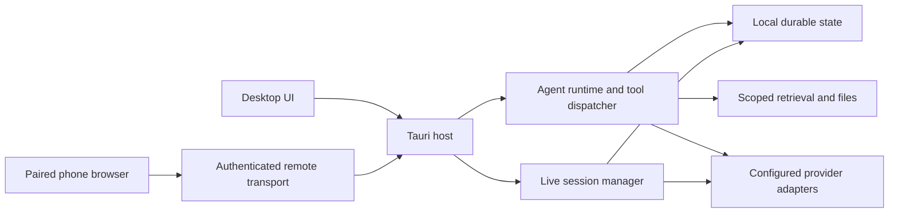

# Nexa Architecture

Status: canonical architecture entry point.

Nexa is a local-first desktop assistant composed of a React user interface in a
Tauri shell, a Rust application and agent runtime, and SQLite-backed durable
state. This document is the single architecture index. Detailed contracts live
in the focused documents linked below; research notes and dated audits do not
become architecture merely by being stored in the repository.

## System boundaries

| Boundary | Responsibility | Primary implementation |
| --- | --- | --- |
| Desktop presentation | Navigation, chat, settings, task state, previews, accessibility, and user-controlled interaction | `apps/desktop/src` |
| Native desktop bridge | Tauri commands, window and tray ownership, operating-system integration, and event projection | `apps/desktop/src-tauri` |
| Core runtime | Agent turns, provider adapters, tools, retrieval, persistence, workflows, and local media/document capabilities | `crates/core/src` |
| Remote transport | Device pairing/revocation, authenticated HTTP and WebSocket requests, encrypted LAN listeners, and managed public routes | `crates/remote/src` |
| Phone presentation | Remote chat, model choices, previews, dictation, and Live using the desktop host | `apps/desktop/src/features/remote` |
| Live observation | Bounded input/session lifecycle, native realtime or incremental observation, text records, and summaries | `crates/core/src/live_analysis` |
| Office live host | Separately paired Word/Excel/PowerPoint operations with declared host capabilities | `integrations/office-addin` and `crates/core/src/office_live_bridge.rs` |
| Shared catalogs | Provider, model, modality, and capability descriptors consumed by both frontend and backend | `shared/` |
| Durable state | Conversations, turns, tool results, checkpoints, settings, sources, and indexes | SQLite migrations and stores under `crates/core/src` |

The UI is a projection of runtime state, not a second source of truth. Provider
payloads and operating-system events enter through explicit adapters. Durable
records authorize replay and recovery; transient UI state must not invent a
successful tool execution or model response.

Remote transport exposes typed host commands rather than arbitrary Tauri IPC.
The desktop still owns execution, credentials, previews, and approval decisions.
Transport liveness is distinct from committed Agent Run progress. Public route
readiness verifies the actual HTTPS, RPC, and WebSocket path before advertising
an endpoint. A browser session or Live observation is also a separate lifecycle
from an Agent Run; it must not manufacture run completion.

## Run Event publication boundary

The core runtime owns one Run Event outbox per Agent Run. It is the sole
authority for Run Event sequencing, batching, Run Event-derived task
projection, and terminal acceptance. Producers submit unsequenced events
through a bounded, non-blocking interface; the native desktop bridge supplies
only the post-commit delivery adapter. Consequently, a missing main window
cannot block durable run completion, and presentation code cannot race the core
ledger with a second sequence or terminal decision.

Replaceable tool-input previews use a separate ephemeral publication method on
that same outbox. They retain live sequence order but never enter SQLite, and
queue pressure may drop them without failing the authoritative run. Durable
lifecycle boundaries still flush and commit before delivery.

Resumable phases such as paused and awaiting user input keep the same outbox
open. True terminal outcomes close it permanently, and finalization crosses the
completion barrier only after both the terminal event and task projection are
durable. Per-run lifecycle serialization also covers durable continuation
claims, executor spawn, session registration, pause, and stop. Startup recovery
uses the Run Event ledger to restore suspensions or terminalize interrupted
work instead of letting task rows invent a second outcome. The detailed
batching, failure, recovery, and wire rules are normative in the
[Agent Streaming Protocol](./AGENT_STREAMING_PROTOCOL.md).

## Cross-cutting invariants

1. **Local-first ownership.** Indexes, conversation history, settings, and
   project state remain local. External providers receive only the scoped input
   required for the selected request.
2. **Durability before continuation.** State required by the next model request
   or recovery path must commit successfully before it is appended to the live
   context or exposed as completed.
3. **Provider-boundary fidelity.** Provider-native transcripts are replayed once
   and validated at the final wire boundary. Display projections never replace
   opaque reasoning signatures, tool-call IDs, or provider ordering rules.
4. **One capability catalog.** Shared catalog descriptors and the configured
   endpoint define model capabilities. UI and Rust adapters must not maintain
   divergent provider facts or grant trusted credentials to unknown endpoints.
5. **Explicit authority.** Read, write, desktop-control, terminal, connector,
   and native-plugin operations retain their permission and workspace
   boundaries. Tool output and external content are untrusted input.
6. **Recoverable interaction.** Long-running work, user questions, approvals,
   cancellations, and checkpoints use durable lifecycle records rather than
   prompt-only state.
7. **Bounded presentation.** Streaming and trace surfaces stay responsive,
   preserve reduced-motion behavior, and avoid turning internal diagnostics into
   normal chat content.
8. **Typed prompt projection.** Conversation history, provider-native replay,
   controller state, audit records, and the final assistant answer are separate
   projections. Volatile runtime/controller rows never become durable dialogue;
   an incompatible legacy tool unit may retain its independent visible assistant
   answer, but never synthesizes tool names, receipts, or replay diagnostics into
   an assistant message. A source-aware final-answer guard resets and retries one
   reserved-header leak, then fails closed without persisting a second leak.
9. **Truthful speech capability.** Speech-to-text catalogs distinguish complete
   file input from chunk streams and final-only delivery from interim results.
   A fast batch engine or rolling-window wrapper is not advertised as realtime;
   live adapters normalize append deltas versus replaceable snapshots before the
   composer sees them, and manual composer edits take ownership over provider
   hypotheses.
10. **Evidence lineage.** Graphs, summaries, and compiled claims navigate to
    supporting material. Source/path filters remain effective when opening
    details or evidence; an edge is not independent factual support.
11. **Explicit remote access.** Pairing grants a device access to the supported
    desktop surface. Authentication, installation identity, revocation, and
    approval ownership remain enforced on every request and reconnect.
12. **Capture lifecycle.** Live input begins after provider readiness, stays
    bounded, pauses on disconnect, and releases devices on exit or failure.
    Stored text records do not imply raw media was never sent to a provider.

## Normative runtime contracts

- [Agent Streaming Protocol](./AGENT_STREAMING_PROTOCOL.md) defines the core
  Run Event outbox, versioned wire schema, commit-before-delivery ordering,
  batching, terminal completion barrier, fail-closed recovery, block offsets,
  and window-scoped projection channels.
- [Terminal and Agent Bridge](./TERMINAL_AGENT_BRIDGE.md) defines the boundary
  between the user-owned PTY and approval-gated agent interaction.
- [Live File-Tool Streaming](./LIVE_FILE_TOOL_STREAMING.md) separates partial
  previews from complete schema-valid execution and durable results.
- [Orchestration Runtime](./ORCHESTRATION_RUNTIME.md) defines workflow IR,
  fan-out, checkpoints, verification, and quality-profile behavior.
- [Scheduled Tasks](./SCHEDULED_TASKS.md) defines recurrence, occurrence
  claiming, unattended execution policy, and compatibility boundaries.
- [Ecosystem Architecture](./ECOSYSTEM_ARCHITECTURE.md) defines capability,
  connector, skill, workflow, adapter, and native-plugin lanes.
- [Models and Providers](./PROVIDERS_AND_MODELS.md) defines connection,
  capability, and credential ownership; [Subscription Agents](./SUBSCRIPTION_AGENTS.md)
  details official runtime integration.
- [Knowledge and Retrieval](./KNOWLEDGE_AND_RETRIEVAL.md) defines source,
  evidence, collection, and graph interpretation boundaries.
- [Phone Access](./remote-access.md) covers pairing, routes, typed remote
  commands, and recovery; [Voice and Live](./LIVE.md) owns capture contracts.
- [Local HTML Preview](./local-html-preview.md) defines explicit asset grants
  and preview-session revocation.
- [Tool Reference](./TOOLS.md) links executable schemas and focused tool contracts.
- [Office add-in](../integrations/office-addin/README.md) defines separately
  authorized live Office operations and deployment trust.

## Change discipline

Architecture changes must update the smallest relevant normative document and
add regression coverage at the affected boundary. A primary-source investigation
may inform a change, but it belongs in an Issue, PR discussion, or the ignored
`docs/research/` workspace. Stable contracts should explain Nexa's behavior and
invariants, not mirror a particular upstream version or preserve a dated source
dump.

See [README.md](./README.md) for the full documentation index.
