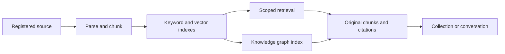

# Knowledge and retrieval

Nexa turns registered local sources into searchable evidence. The index helps
find material; the original documents and retrieved chunks support the answer.

## Start with a source

1. Add a folder in Sources. Review include/exclude patterns and privacy settings
   before indexing it.
2. Wait for parsing and indexing to finish. OCR, local embeddings, and media
   ingestion need their configured runtime assets.
3. Search for a known filename or phrase, inspect the result, and open its
   supporting text before using the answer.
4. Narrow by source or file type when the working set matters. Start Chat from
   that scope, or save useful chunks in a Collection and continue from there.

Supported inputs include Markdown, plain text, logs, PDF, DOCX, XLSX, PPTX, and
images. The enabled features and available runtimes determine OCR/media behavior.
Parsing failure or an unfinished embedding job must not be presented as a
fully indexed source.

## Evidence flow

Hybrid retrieval combines SQLite FTS5 with vector similarity when embeddings
are available. Source, path, type, and other supported filters bound the work.
The agent can use `search_knowledge_base`, `retrieve_evidence`, and
`get_chunk_context` to find and inspect supporting text.

Recall Mode helps with vague memories by collecting clues about a document.
Collections retain selected evidence and notes for later investigation. The
code still uses `playbook` in several persistence/tool interfaces; this is the
historical implementation name for the user-facing collection surface.

## Knowledge graph

The Knowledge page and `query_knowledge_graph` expose a compiled entity and
relationship index. Use it to locate relevant entities, relationship bundles,
connection paths, and the documents worth reading next.

- Graph context is scoped by the conversation's sources. Explicit source
  filters must stay within that scope.
- Path prefixes, entity types, relationship types, and minimum strength narrow
  the graph. The page and tool must preserve those filters when loading details
  and evidence.
- Repeated mentions or graph edges do not independently establish a fact.
  Retrieve the supporting document/chunk before citing the claim.
- Co-occurrence, inferred relationships, and directly supported relationships
  need distinct interpretation. A path explains an index connection, not
  necessarily a causal or verified relationship.
- Results are bounded. A compact graph response is not a complete export of
  every indexed entity, relationship, or source document.

The tool's complete filter schema is linked from [Tool reference](TOOLS.md).

## Scope, freshness, and recovery

Registered source roots, conversation source scope, and project membership are
runtime boundaries. A link in a document or an instruction in retrieved content
does not expand those permissions. Retrieved material remains evidence rather
than a new instruction from the user.

Incremental ingestion uses file changes/content identity to refresh indexes.
After changing source settings or files, inspect indexing status before assuming
the search/graph view is current. When evidence is absent, distinguish an empty
result from an unindexed, excluded, unsupported, or failed source.

Local indexes, cached summaries, and generated claims may differ from the source
file's latest contents. Verification should return to the underlying document
when freshness affects the decision. Local-first storage does not prevent
configured API embedding or generation services from receiving scoped input.

Removing a Source removes its indexed document/chunk records through database
cascades while leaving the original files on disk. For a moved/renamed folder,
update its existing root instead of deleting and recreating the source. Check
the [source tool contract](TOOLS.md#manage_source) before changing registration.

## Implementation and checks

| Responsibility | Implementation |
| --- | --- |
| Source registration | [sources.rs](../crates/core/src/sources.rs) |
| Ingestion and parsing | [ingest.rs](../crates/core/src/ingest.rs), [parse.rs](../crates/core/src/parse.rs) |
| Search and embeddings | [search.rs](../crates/core/src/search.rs), [embed.rs](../crates/core/src/embed.rs) |
| Graph and scoped queries | [knowledge_graph.rs](../crates/core/src/knowledge_graph.rs), [graph tool](../crates/core/src/tools/knowledge_graph_tool.rs) |
| Desktop graph commands | [knowledge.rs](../apps/desktop/src-tauri/src/commands/knowledge.rs) |
| Graph filter regressions | [knowledge-graph-filters.spec.ts](../apps/desktop/e2e/knowledge-graph-filters.spec.ts) |

Run the affected core tests and browser specs from the
[contribution guide](../CONTRIBUTING.md#verification). Test source/path filter
changes at both the displayed graph and the evidence opened from it.
