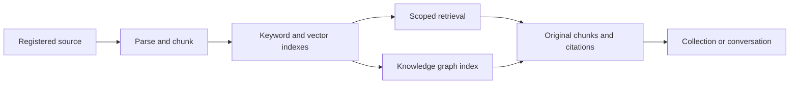

# Knowledge and retrieval

Nexa turns registered local sources into searchable evidence. The index helps
find material; the original documents and retrieved chunks support the answer.

## Start with a source

1. Add a folder in Sources. Directory scans do not follow symbolic links. Review include/exclude patterns and privacy settings
   before indexing it.
2. Wait for parsing and indexing to finish. OCR, local embeddings, and media
   ingestion need their configured runtime assets.
3. Search for a known filename or phrase, inspect the result, and open its
   supporting text before using the answer.
4. Narrow by source or file type when the working set matters. Start Chat from
   that scope, or save useful chunks in a Collection and continue from there.

Supported inputs include Markdown, plain text, logs, PDF, DOCX, XLSX, PPTX, and
images. The enabled features and available runtimes determine OCR/media behavior.
Parsing failure or an unfinished embedding job must not be presented as a
fully indexed source.

## Evidence flow

```mermaid
flowchart LR
  Source[Registered source] --> Parse[Parse and chunk]
  Parse --> Index[Keyword and vector indexes]
  Index --> Search[Scoped retrieval]
  Search --> Evidence[Original chunks and citations]
  Evidence --> Collection[Collection or conversation]
  Index --> Graph[Knowledge graph index]
  Graph --> Evidence
```

Hybrid retrieval combines SQLite FTS5 with vector similarity when embeddings
are available. Source, path, type, and other supported filters bound the work.
The agent can use `search_knowledge_base`, `retrieve_evidence`, and
`get_chunk_context` to find and inspect supporting text.

Chinese lexical indexing preserves ordered CJK bigrams and single-character
terms alongside Latin words and identifiers. The migration, ingestion triggers,
read connections, and FTS rebuild use the same projection. This improves literal
Chinese retrieval. Deterministic second-pass word expansion is labeled as keyword
expansion, not model-generated HyDE. Cross-language paraphrases still require a suitable embedding
or reranking model and separate evaluation. Search dates refer to **index time**,
not publication time or the effective date of a claim.

Search keeps query, source filters, mode, loading, errors, and feedback attached
to the current request. Source changes trigger retrieval; failed requests expose
a retry action. A card's Chat action carries the active source scope and its
versioned evidence reference. Returning from Chat restores the search workspace.

Pagination uses one bounded candidate horizon independent of page size or offset:
up to 200 keyword/vector-ranked blocks, plus evidence from up to 120 graph
documents. Scope filters apply before those budgets. Ranking and document packing
finish before pagination, so `totalMatches` counts the available packed results,
not raw matching chunks. `candidateLimitReached` tells the UI and tools when to
narrow the query or source filters. Research packs at most three direct blocks
per document across that same result set. Equal scores have deterministic order.
Page consistency assumes unchanged indexed data, feedback, configuration and
service responses; this is a live query, not a saved search snapshot. If retrieval
or ranking falls back during active UI pagination, the UI restarts at page one.
TF-IDF fallback from a configured embedding service is reported separately from
cloud-to-local dense-vector fallback so either transition changes that basis.

## Read the cited version

Evidence references carry source ID, document ID, index revision, raw file hash,
block ID/hash, extraction method, and a format-specific location. The reader
shows the selected block, adjacent text, and paginated document sections.

| Input | Location and interpretation |
| --- | --- |
| Text and Markdown | UTF-8 byte ranges and original line numbers; short facts are retained |
| PDF | Page number, with optional normalized top-left bounding box; native coverage is checked per page |
| DOCX | Package part, paragraph, or table/row; no fabricated page number |
| XLSX/XLS | Worksheet and original cell range, including used ranges that begin away from A1; formulas and cached values remain distinct |
| PPTX | Presentation slide order and speaker notes |
| Media | Time range when provided by media analysis |
| Extracted HTML/EPUB/legacy text | Extracted section, not a claim of an exact file-line location |

Text and media locations cover any neighboring text included in the evidence.
Copied table headers retain a separate source row/cell range, which the preview
highlights alongside the main result. DOCX previews preserve native paragraph,
table, and row identities when empty content is omitted. Text selection maps
browser-normalized newlines back to the original source before an agent handoff.

Native PDF OCR uses supported embedded page images. It is not a full rendered-page
layout engine. Uncovered pages and heuristic legacy extraction are visible as
parse warnings. The optional Docling service below handles PDF layout/OCR when
its separate runtime has been provisioned.

Updating or reparsing a document creates a new index revision even when the file
bytes are unchanged. Existing references retain their original text. Deleted
files leave historical evidence while their source remains registered; deleting
the source revokes that archive and its saved research cells. Exclusion/privacy
removal also forgets the affected indexed document's archive. Archives consume
local storage until their owning source/document scope is removed.

Opening a current original checks its file hash before applying an old location.
If it changed, the preview explains the mismatch. Historical evidence opens the
current file only through an explicit action without reusing the old location.
Parser-profile changes reparse unchanged files on the next scan; Sources exposes
the remaining reparse count until that scan completes.

## Saved research comparisons

Expand **Research comparison** in Search. Select up to eight documents, enter up
to six questions (one per line), and save the set. **Refresh / continue** retrieves
up to three complementary blocks per document/question instead of collapsing a
whole document to one result. Source and document filters are applied before
candidate limits, including vector and graph expansion.

Cells begin as pending, needs review, or not found in this search. Review can add
notes and mark a cell supported or conflicting; those labels represent the
user's review, not an automatic fact check. Every retrieved excerpt opens its
versioned evidence. A missing result does not establish absence from the corpus.

Each refresh schedules at most twelve searches and stops scheduling after thirty
seconds; an in-flight search finishes under its provider/service timeout.
Completed cells are saved individually. Repeat to continue. Source changes mark
affected cells stale and block acceptance until refreshed. Refresh retains user
notes but resets the affected review state. Concurrent edits use a set revision
check so one window cannot silently overwrite another window's review.
Missing documents or documents without indexed body text are visibly unavailable,
including cells never refreshed before removal. Saved evidence and notes remain;
select a current document in a new set to replace a removed document identity.

## Optional local model services

In **Settings → Models & embedding → Local knowledge services**, configure
explicit loopback HTTP URLs. Empty fields disable the services. Only numeric
loopback hosts are accepted; redirects and system proxies are disabled. Nexa
does not start these services or download their models automatically.

- **Cross-encoder reranker:** a [Text Embeddings Inference `/rerank` endpoint](https://huggingface.co/docs/text-embeddings-inference/quick_tour)
  using a supported model, for example a separately deployed BGE reranker. The
  request contains the query and bounded candidate text. Defaults are 64
  candidates, 6,000 characters per candidate, and five seconds. Missing,
  duplicate, or invalid scores reject the entire response and retain rule
  ranking. Search exposes which method ran and any fallback reason. Embedding
  pooling is never presented as cross-encoder reranking; a Qwen embedding server
  alone does not implement the reranker protocol.
- **Docling PDF parser:** install Docling in an isolated Python environment and
  start [docling_service.py](../scripts/knowledge/docling_service.py), passing
  `--root` for every permitted source directory. For example, run
  `python scripts/knowledge/docling_service.py --root D:/Documents` from the repo,
  then configure `http://127.0.0.1:8091/parse`. Its default request budget is 180
  seconds. The service retains complete Docling JSON in its cache and sends
  ordered text/table blocks with page provenance to Nexa. A block spanning
  multiple pages is retained once as extracted content with its source page
  range; it does not claim a specific PDF page or bounding box for each row.
  Single-page fragments use one covering bounding box. Adapter versions are
  part of the parser profile so rescanning replaces older location mappings.
  Model/runtime
  installation and model downloads belong to that environment. OCR defaults to
  English and simplified Chinese; use `--ocr-languages en,ch_tra` for traditional
  Chinese. The service defaults to cached model artifacts; explicitly pass
  `--allow-model-downloads` to provision missing models on first use. A conversion
  failure is a scan error and retains the previous index.

See Docling's [document model](https://docling-project.github.io/docling/reference/docling_document/)
for provenance and serialization. Service contract tests execute the actual
HTTP/ingestion/ranking paths with fixture responses; they do not measure model
accuracy. Source files and candidate text remain on loopback for these adapters,
but separately configured embedding/generation providers can still receive input.

Recall Mode helps with vague memories by collecting clues about a document.
Collections retain selected evidence and notes for later investigation. The
code still uses `playbook` in several persistence/tool interfaces; this is the
historical implementation name for the user-facing collection surface.

## Knowledge graph

The Knowledge page and `query_knowledge_graph` expose a compiled entity and
relationship index. Use it to locate relevant entities, relationship bundles,
connection paths, and the documents worth reading next.

- Graph context is scoped by the conversation's sources. Explicit source
  filters must stay within that scope.
- Path prefixes, entity types, relationship types, and minimum strength narrow
  the graph. The page and tool must preserve those filters when loading details
  and evidence.
- Repeated mentions or graph edges do not independently establish a fact.
  Retrieve the supporting document/chunk before citing the claim.
- Co-occurrence, inferred relationships, and directly supported relationships
  need distinct interpretation. A path explains an index connection, not
  necessarily a causal or verified relationship.
- Results are bounded. A compact graph response is not a complete export of
  every indexed entity, relationship, or source document.

The tool's complete filter schema is linked from [Tool reference](TOOLS.md).

## Scope, freshness, and recovery

Registered source roots, conversation source scope, and project membership are
runtime boundaries. A link in a document or an instruction in retrieved content
does not expand those permissions. Retrieved material remains evidence rather
than a new instruction from the user.

Incremental ingestion uses file changes/content identity to refresh indexes.
After changing source settings or files, inspect indexing status before assuming
the search/graph view is current. When evidence is absent, distinguish an empty
result from an unindexed, excluded, unsupported, or failed source.

Local indexes, cached summaries, and generated claims may differ from the source
file's latest contents. Verification should return to the underlying document
when freshness affects the decision. Local-first storage does not prevent
configured API embedding or generation services from receiving scoped input.

Enabling redaction or changing active redaction rules atomically revokes old
indexed text, generated summaries/relations, and saved citation history, including
files already removed from disk. Sources then require rescanning and recompilation.
Research notes remain, but revoked evidence cannot be reopened through old block
IDs or versioned references. A scan started under earlier settings cannot commit
its old output after this change. Saving unchanged rules preserves rebuilt content
and safe history. Invalid redaction/exclusion expressions are rejected before the
saved policy or index is changed.
Copied research titles, section labels, frontmatter, and visual metadata follow
the same redaction rules. A masked worksheet name becomes extracted evidence
without an exact worksheet locator. Retained manual graph relationships keep
their identities while protected labels are masked and matching aliases removed.
Source deletion under a stricter scan policy revokes the resulting archive within
the deletion transaction, including when the file was still indexed at scan start.

Compilation reads every non-summary source character in bounded 12,000-character
sections, with eight new model calls per action. Completed sections are cached
by input revision, provider route, prompt contents, and compiler contract version.
Partial coverage is explicit and can resume;
it never becomes a complete summary search chunk. Model responses and aggregate
summary lengths are bounded. Entity contexts and relationship evidence must quote
the input; unsupported edges are discarded. Supplied relationship confidence
must be finite and within 0–1; invalid values are discarded with the relation.
This is grounding validation, not a guarantee that a model's prose is correct.

Summary commits check the input revision again after model calls. Changed inputs
invalidate summaries, document/entity membership, and that document's relation
support. Relations supported by other current documents remain. Claims/events
created from indexed block/document IDs bind their input revision and return to
review when that revision changes. Legacy unversioned assertions require review.

Sources shows document, chunk, keyword, embedding, compilation, failure, and
legacy-reparse counts separately. Scan/embedding/compilation/research jobs are
owned by the runtime and saved with monotonic progress revisions. Navigation
does not clear them. Startup marks unfinished work interrupted; retry is explicit.

## Framework boundaries and evaluation

Docling and a standard cross-encoder service are optional adapters around Nexa's
existing SQLite/evidence ownership. PageIndex-style section navigation is
implemented using the indexed outline and resumable compilation, without a
second document database. HippoRAG, LightRAG, and Microsoft GraphRAG remain
comparison candidates for future multi-hop/global model evaluations; installing
a second graph runtime would not establish better evidence quality. PaddleOCR
layout pipelines and MinerU are parser comparison candidates, with runtime and
model licensing assessed separately. No untested model is enabled by default.

Visual artifacts and chart/OCR text remain searchable. Qwen-VL/ColQwen visual
embeddings and USearch ANN are not enabled by this repair: they require separate
model-quality or scale measurements and, for multi-vector models, a different
index/scoring contract. The existing exact vector route remains authoritative.

Run `cargo run -p nexa-core --example knowledge_eval --no-default-features
--features host-tools -- report.json` for an authored bilingual retrieval fixture
and 1k/10k/50k-chunk exact-vector timing probe. The JSON reports literal retrieval,
source exclusion, rebuild consistency, a separate cross-language diagnostic,
first/warm latency, and index size. Its synthetic 64-dimensional vectors and
development build timings are not real-model accuracy or production capacity
claims; first query does not mean an OS cold-cache measurement.

Removing a Source removes its indexed document/chunk records through database
cascades while leaving the original files on disk. For a moved/renamed folder,
update its existing root instead of deleting and recreating the source. Check
the [source tool contract](TOOLS.md#manage_source) before changing registration.

## Implementation and checks

| Responsibility | Implementation |
| --- | --- |
| Source registration | [sources.rs](../crates/core/src/sources.rs) |
| Ingestion and parsing | [ingest.rs](../crates/core/src/ingest.rs), [parse.rs](../crates/core/src/parse.rs) |
| Search and embeddings | [search.rs](../crates/core/src/search.rs), [embed.rs](../crates/core/src/embed.rs) |
| Evidence and native structure | [evidence.rs](../crates/core/src/evidence.rs), [document_structure.rs](../crates/core/src/document_structure.rs) |
| Optional services and research | [knowledge_services.rs](../crates/core/src/knowledge_services.rs), [research_workspace.rs](../crates/core/src/research_workspace.rs) |
| Graph and scoped queries | [knowledge_graph.rs](../crates/core/src/knowledge_graph.rs), [graph tool](../crates/core/src/tools/knowledge_graph_tool.rs) |
| Desktop graph commands | [knowledge.rs](../apps/desktop/src-tauri/src/commands/knowledge.rs) |
| Graph filter regressions | [knowledge-graph-filters.spec.ts](../apps/desktop/e2e/knowledge-graph-filters.spec.ts) |
| Search and evidence regressions | [search-ask-ai-scope.spec.ts](../apps/desktop/e2e/search-ask-ai-scope.spec.ts), [knowledge-evidence.spec.ts](../apps/desktop/e2e/knowledge-evidence.spec.ts) |

Run the affected core tests and browser specs from the
[contribution guide](../CONTRIBUTING.md#verification). Test source/path filter
changes at both the displayed graph and the evidence opened from it.
