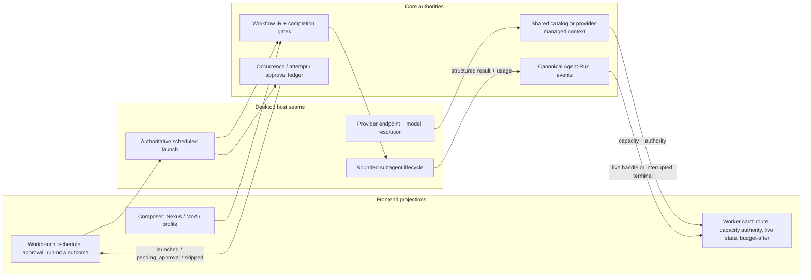

# Orchestration Runtime

This document records the current runtime contracts behind Nexa's
Mixture-of-Agents (MoA), Nexus, and orchestration quality profiles. Nexa owns the
implementation and verification of these contracts; the design references below
do not imply wire or configuration compatibility with another project.

## Design sources

- [Together Mixture-of-Agents paper](https://arxiv.org/abs/2406.04692) and
  [reference implementation](https://github.com/togethercomputer/moa) establish
  the parallel reference-model and acting-aggregator pattern.
- [Hermes Agent `moa_loop.py`](https://github.com/NousResearch/hermes-agent/blob/main/agent/moa_loop.py)
  demonstrates production constraints that the original paper does not cover:
  advisors are tool-free, fan-out is bounded, partial advisor failure is not
  fatal, private reference context is filtered, and usage is attributed to the
  model that incurred it.
- [Anthropic's orchestrator-workers and evaluator-optimizer patterns](https://www.anthropic.com/engineering/building-effective-agents)
  motivate independent parallel reconnaissance followed by explicit synthesis
  and verification.
- [Magentic-One](https://github.com/microsoft/autogen/tree/main/python/packages/autogen-magentic-one)
  provides a useful reference for an orchestrator-led multi-agent team with
  specialized workers.
- [LangGraph checkpointing](https://github.com/langchain-ai/langgraph/tree/main/libs/checkpoint)
  informed the decision to make workflow progress serializable rather than
  keeping scheduler state only in a prompt.
- [Codex subagents](https://learn.chatgpt.com/docs/agent-configuration/subagents)
  establish independent inspectable worker threads, parent inheritance for
  omitted model settings, and explicit orchestration controls.
- [Gemini CLI subagents](https://github.com/google-gemini/gemini-cli/blob/main/docs/core/subagents.md)
  demonstrate isolated tool registries, provider/model inheritance, and
  recursion protection.
- [pi's subagent extension](https://github.com/earendil-works/pi/blob/main/packages/coding-agent/examples/extensions/subagent/index.ts)
  demonstrates isolated processes, single/parallel/chain delegation, bounded
  concurrency, streaming usage, and abort propagation.

## Product contracts

MoA and Nexus are independent axes. MoA changes how an acting model receives
advice. Nexus changes how the client plans, delegates, checkpoints, and verifies
work. Either may be enabled alone or both may be composed.

Provider reasoning effort remains a third, independent axis. `Code Ultra` and
`Research Ultra` are Nexa orchestration profiles; they must never be sent to a
provider as invented reasoning-effort values.

High-cost behavior is explicit and per conversation. The composer shows when
MoA or a non-balanced profile is active, explains the added calls and token
cost, and preserves an off/balanced path.

## Authority and projection map

Frontend state is never a second authority: controls project saved/runtime
contracts, worker cards project lifecycle artifacts and canonical parent state,
and Workbench projects occurrence decisions returned by the backend seam.

## MoA execution boundary

`MoaProvider` wraps the acting provider without changing the provider contract.
On an eligible cadence it:

1. Builds a deterministic, privacy-filtered advisor view of the turn.
2. Calls configured advisor providers concurrently with no tools.
3. Keeps successful advice when another advisor fails.
4. Appends private labelled advice to the acting aggregator's context.
5. Lets only the aggregator use tools, stream user-visible output, and own turn
   termination.
6. Aggregates normalized usage while retaining per-slot model and reasoning
   settings.

The built-in presets (`Fast Review`, `Deep Research`, and `Cross-model Code
Review`) are shortcuts over this contract. `Custom` remains bounded by the same
fan-out, cadence, privacy, and token-reserve controls.

## Workflow IR and Nexus execution

Nexus compiles the typed task plan into versioned `WorkflowIr` before the first
model request. The IR is a validated DAG containing dependencies, parallel
groups, model-routing classes, tool policy, write isolation, retry policy,
structured deliverables, an evidence ledger, checkpoints, verification gates,
and a completion contract.

The ordinary `Balanced` profile may still publish a task-plan artifact for
observability, but that artifact is advisory: it is omitted from the model
prompt, unfinished plan nodes do not reject a valid answer, and `update_plan`
is never a prerequisite for evidence, file, shell, or verification tools.
Strong node-completion gates are activated only by explicit Nexus,
Deep/Custom/Ultra, or scheduled-isolation policy. In those modes the
controller's tool results, checkpoints, and verification records are
authoritative; model-authored plan prose is only a projection.

For non-trivial Nexus turns, the runtime automatically dispatches the first two
ready reconnaissance nodes through `spawn_subagent_batch`. This is a controller
action, not prompt advice. The wave is read-only, each worker has a stable node
id, and worker results update sibling nodes independently. The controller keeps
dispatching any retryable failed node until it succeeds or exhausts its node
retry policy, without discarding successful branches.

Each delegated node carries its model-routing class into the executor. `Fast`
and `IndependentReviewer` use the configured auxiliary model only when that
model belongs to the same provider endpoint as the parent; otherwise the run
records an explicit fallback and keeps the parent model. `Strong` always keeps
the parent model. This provider-compatibility guard prevents cross-provider
model names from being sent with the wrong endpoint or credentials.

The acting agent receives the updated IR and owns mutation and synthesis.
`Code Ultra` additionally requires isolated writes plus test, typecheck, build,
and independent-review gates. `Research Ultra` raises evidence and independent
verification requirements without forcing a code workspace.

## Model-independent stuck-loop recovery

Nexa treats tool calls as structured runtime events, never as promises written
in an assistant draft. Ordinary turns do not require a tool call or a plan:
models may answer directly, use concrete tools, or ask one focused question.
The runtime intervenes only after observed repetition. Consecutive plan/goal
bookkeeping without a concrete action receives one nudge that explicitly makes
bookkeeping optional; continuing the same loop terminates with a structured
error. Repeated call signatures, repeated answer shapes, and consecutive tool
errors have their own bounded counters, and any concrete action resets the
bookkeeping window. This avoids both prompt-specific patches and a global
"must call a tool" policy that would reject valid direct answers.

Stream recovery uses the same event authority. Answer text, thinking chunks,
and generic tool arguments are resettable drafts until the model sample closes
and the controller dispatches a tool; an interrupted draft is cleared and may
be replayed within the bounded transport budget. A provider-hosted action is a
real replay barrier because it may already have executed remotely, so only that
state suppresses automatic replay. The former `visible_output` shortcut was
removed because it conflated UI projection with side effects and caused
DeepSeek-style streamed write calls to fail before dispatch.

`StreamReset(discardSample=true)` is authoritative across core, durable Run
Events, and the frontend projection. It removes the abandoned answer/thinking
suffix and any preparing tool cards instead of retaining them as a false
cancelled round; completed tools from earlier samples remain. Historical reset
events without this field preserve their legacy projection. Terminal error
classification is independent of the replay barrier: rate limits retain their
retry delay/category, context overflow requests compaction, permanent provider
errors fail, and only typed transient/transport failures use reconnect.

## Turn budgets and provider terminals

One user turn is an open semantic loop, not a `for sample in 0..max_iterations`
loop. The runtime keeps these authorities independent:

- a transport retry budget replays one frozen physical request;
- output continuation completes an output-limited response and never spends a
  tool round;
- context rollover compacts or moves committed history and never spends a tool
  round;
- the optional legacy `maxIterations` setting is interpreted only as the number
  of complete, validated tool batches that enter execution, including
  controller-owned direct dispatch, retrieval prefetch, and reconnaissance as
  well as model-directed client tools;
- cumulative token, cost, wall-time, and cancellation policy bound the whole
  run independently.

A finite tool-round budget reserves one final answer-only provider sample after
the last dispatched batch. Output continuation remains available for that
sample, but its request carries no client tools. Provider samples, rejected
draft calls, loop-guard-blocked synthetic batches, steering restarts, compaction,
and transport retries have their own sample sequence and do not consume the
user-facing tool budget. Repeated
protocol faults are controlled by the existing consecutive no-progress guard:
committed answer or tool progress resets it, so there is no turn-wide hidden
`MAX_OUTPUT_LIMIT_CONTINUATIONS` counter.

The same budget owner is created before any controller shortcut. A zero value
therefore blocks direct tool dispatch, knowledge prefetch, Nexus/Ultra
reconnaissance, and model tool calls. Each controller-owned prefetch or
reconnaissance wave consumes one logical round before the answer-only synthesis
sample begins; no pre-loop path receives separate hidden tool authority.

Saved tool-round authority is preserved across Balanced, Deep, Code Ultra,
Research Ultra, Nexus, and durable-goal execution. Named quality profiles may
change concurrency, evidence, and verification policy, but only an explicit
Custom value may replace the saved tool-round setting; leaving it blank remains
unlimited.

Provider terminal normalization is conservative. OpenAI Chat `length`,
Responses `incomplete.max_output_tokens`, Anthropic `max_tokens`, and Gemini
`MAX_TOKENS` all become output limits. Anthropic `pause_turn` and
`model_context_window_exceeded`, Gemini malformed-tool terminals, protocol
incompleteness, and unknown raw reasons remain distinct. Unknown terminals never
become a natural stop. A client tool batch may cross the dispatch seam only when
both its provider terminal and every assembled call are complete; a global
output/context limit or malformed terminal vetoes apparently valid JSON.
Anthropic `pause_turn` is resumable only when the adapter captured the exact
ordered provider-native assistant blocks, including server-tool use and result
blocks. Those blocks replay verbatim on the same route; missing or structurally
invalid pause state fails closed instead of restarting a hosted tool.

The design follows the event boundaries in
[earendil-works/pi's agent loop](https://github.com/earendil-works/pi/blob/main/packages/agent/src/agent-loop.ts),
which advances from actual `toolCall` content and exposes explicit steering,
follow-up, and `shouldStopAfterTurn` seams. It also applies the bounded pattern
idea from [OpenHands' StuckDetector](https://github.com/OpenHands/software-agent-sdk/blob/main/openhands-sdk/openhands/sdk/conversation/stuck_detector.py),
the canonical call fingerprint in
[Roo Code's ToolRepetitionDetector](https://github.com/RooCodeInc/Roo-Code/blob/main/src/core/tools/ToolRepetitionDetector.ts),
and Goose's independent turn/tool limits. Prompt-only reminders such as
[Cline's missing-tool retry](https://github.com/cline/cline/blob/main/apps/vscode/src/core/prompts/responses.ts)
are useful as one nudge, but are not sufficient as the terminal safety bound.

## Prompt-cache invariants

Prompt caching is a runtime layout contract, not a provider-specific sleep or
retry trick. Nexa keeps the reusable prefix byte-stable: the kernel prompt,
stable instructions, and the deterministically sorted profile tool schema come
first. Conversation growth, current routing state, clock data, and evidence are
append-only tail units. Compaction is an explicit cold boundary; it must not
silently rewrite earlier messages during a warm turn.

Skill activation has its own reserved prompt lane. Loading a longer skill must
not move the stable policy's truncation boundary; unused policy capacity can
flow toward loaded skill bodies, never in the reverse direction. The available
skill index uses only the remaining budget. See
[context assembly](../crates/core/src/agent/context.rs), including the
`long_policy_prefix_is_stable_when_loaded_skill_size_changes` regression.

The ordinary `Balanced` profile therefore omits the model-facing task plan,
default orchestration-profile prose, and the `update_plan` schema. Those
controller projections added volatile text and a bookkeeping tool to every
request even when the user had not enabled orchestration. Explicit Nexus,
Deep/Custom/Ultra, and scheduled-isolation runs retain the stronger contract.
Tool selection occurs before request assembly and preserves a stable sorted
schema across every step on prefix-cached providers.

Large context windows do not justify pinning the entire registry. The resident
surface is capped at 24 definitions and 12,000 estimated tokens, contains the
small stable coding/read/write/search set plus `tool_search`, and activates
specialist tools through discovery. Available-skill metadata is relevance
ranked and capped at 12 unless the user explicitly pins or invokes a skill.

Prompt IR roles are compiled at the provider boundary. For OpenAI-compatible
Chat Completions routes, every system-plane block is moved into the leading
control prefix while transcript roles retain their order; controller/runtime
tails must never be relabelled as a newer `user` request. Per-request output
budget planning records requested/effective tokens, explicit, verified catalog,
or unknown-model reserve authority, catalog capacity, and context capacity.
Legacy saved per-request caps are retired. Automatic wire limits use the exact
endpoint/model capability and actual prompt headroom. The local context reserve
(including half-window allocation and unknown-model estimates) never becomes a
provider output ceiling. Unknown routes leave output provider-managed. Explicit
worker budgets remain authoritative within the real model capacity.

This follows DeepSeek's documented exact-prefix cache semantics and the
immutable-prefix/append-only-log split in
[Reasonix](https://github.com/esengine/deepseek-reasonix/blob/main/docs/ARCHITECTURE.md).
It also follows Zed's practice of updating model-visible project context only
when its value changed and its deterministic tool map. Nexa intentionally does
not copy Zed's early execution of partially streamed generic tool arguments:
generic arguments remain resettable drafts until a complete call is assembled,
validated, and dispatched. That separation makes reconnect safe without
duplicating writes.

For a mutation-capable Code Ultra workflow, the controller requires exactly one
clean Git-backed source, creates a detached temporary worktree, registers it as
a non-watched source for the turn, scopes execution only to that source, and
rewrites filesystem paths, exact shell argv repository paths, and shell working
directories into it while rejecting outside or traversing paths. External
processes run under an OS filesystem sandbox: bubblewrap on Linux/Windows WSL,
or the macOS sandbox profile. The host filesystem is read-only; only the isolated
worktree and ephemeral temp storage are writable. If that backend is unavailable,
Code Ultra refuses to start. Free-form shell commands, shell interpreters, inline
interpreter code, and `project_tool run` remain withheld as defense in depth.
Test, lint, typecheck, and build gates are derived from successful command
execution artifacts, never model-authored labels. Before execution, the
controller inspects project manifests and configuration to require only
supported gate categories; missing categories are recorded as controller-owned
not-applicable gates. Only after every other required gate passes does the
controller generate a binary Git patch,
verify it with `git apply --check`,
promote it to the original clean worktree, and remove the temporary source. The
write-isolation gate is set only by this runtime transition; a model-authored
`record_verification` label cannot satisfy it. Likewise, independent review is
derived only from a successful `subagent_judgement` runtime artifact for normal
interactive Code Ultra. A scheduled isolated patch cannot delegate outside its
sandbox, so its stronger request kind removes delegation nodes, requires
promotion even when the planner underpredicts mutation, and satisfies the same
gate only through the controller's non-delegating Git diff/applicability review.

Plan Mode compiles a separate read-only completion contract: mutation and
delegation tools are removed from Workflow IR nodes, execution/release gates are
omitted, and no isolated worktree or process sandbox is created.

## Delegated context authority

Every delegated worker owns an independent model conversation. The parent sends
only the task baton, selected evidence, and the bounded handoff payload; it does
not clone the parent's entire transcript into the worker. A worker returns a
structured result and evidence summary to the parent, which remains responsible
for synthesis and user-visible completion.

Context capacity is resolved per provider route and model, not per display name.
The default is `Auto`: use the verified shared-catalog capacity when the route is
known, otherwise leave capacity provider-managed. Nexa must not invent a 32K
limit for an unknown or custom endpoint. A positive user override is authoritative
for that run and may be rejected with a validation error, but it must never be
silently reduced by an unrelated fallback guess.

The following limits are independent and must not be collapsed into one token
number:

- provider input capacity;
- parent-to-worker handoff budget;
- worker output limit;
- aggregate delegated token or cost budget;
- call, concurrency, iteration, and wall-time limits.

Unconfigured call counts, aggregate tokens, per-worker cumulative tokens, queue
deadlines, and worker run deadlines are unlimited. Nexus and named quality
profiles never create those limits or overwrite saved budgets. A shared soft
token target does not become an automatic per-worker hard cap. Worker roles
preserve the selected reasoning controls. Generic tool timers do not time out
delegated workers or adjudication; explicit task deadlines, parent cancellation,
transport liveness, concurrency, and repeated-tool protection remain active.

Runtime artifacts record the requested and effective model policy, capacity,
capacity authority, handoff budget, output limit, and preflight result. The UI
projects those artifacts. Batch cards prefer the authoritative post-batch token
and call budget over each worker's spawn-time preflight snapshot. Lifecycle
controls are shown only while the parent owns a live in-memory handle; a stale
persisted `running` artifact after restart is projected as interrupted. The UI
may show progress summaries, current tools, elapsed time, evidence counts,
usage, and terminal state, but it must not present private chain-of-thought as
an operational status stream.

## Gemini route authority

Google direct, Vertex AI, and OpenRouter are distinct credential and endpoint
authorities. Nexa's built-in `google` route is the direct Gemini API and sends
AI Studio auth keys only through the documented `x-goog-api-key` header; keys
must never enter request URLs, logs, traces, or Run errors. A migration redacts
legacy diagnostics that contained `?key=` URLs.

Gemini 3.7/3.6 direct requests use the native `generateContent` codec with
provider call ids, FunctionResponse names/ids, thought-signature replay, no
deprecated sampling temperature, and documented thinking levels. A Google
`unsupported location` response is permanent for that route and fails fast
with an actionable policy message. It is not retried or silently redirected
across credentials.

OpenRouter exposes separately verified `google/gemini-3.7-flash` and
`google/gemini-3.6-flash` routes with their own key and OpenAI-compatible wire
contract. Users may explicitly select those routes when authorized; Nexa never
turns them into an automatic fallback for a rejected Google direct request.
Vertex or Google-login support requires a future first-class auth type with
project/location and token-refresh ownership, matching the separation used by
Gemini CLI rather than treating a service-account or OAuth credential as an AI
Studio key.

## Operator guidance

Use Standard mode for ordinary work. Enable Nexus for work that benefits from
parallel reconnaissance, checkpoints, independent verification, or an explicit
completion contract. A quality profile controls the workflow depth; provider
reasoning effort remains a separate setting and can use only values the selected
route supports.

Keep model, reasoning, and context controls on `Auto` unless a task requires a
specific documented route or hard budget. Auto means inheritance or provider
defaults, not a hidden small cap. Explicit worker limits are useful for a known
cost ceiling or a provider with a documented deployment-specific capacity. The
composer and worker views must display effective values rather than repeating
static Nexus constants that later profiles can override.

For recurring unattended work, use the durable
[Scheduled Tasks](./SCHEDULED_TASKS.md) surface instead of embedding timers in a
prompt or creating another polling loop.

## Evaluation contract

The `orchestration_runtime` evaluation suite must cover:

- valid DAG construction and parallel readiness;
- structured artifacts, isolated writes, checkpoints, and affected-node retry;
- bounded MoA fan-out and advisor failure fallback;
- the independent four-state matrix for Nexus and MoA;
- strict separation of client orchestration and provider reasoning effort;
- comparison metrics for first-pass completion, tests, regressions, verifier
  true positives, correction rounds, wall time, tokens, estimated cost, and Nexus net
  improvement.

Runtime quality claims should be made only after comparing the relevant profile
against the balanced direct baseline on the same task set.
